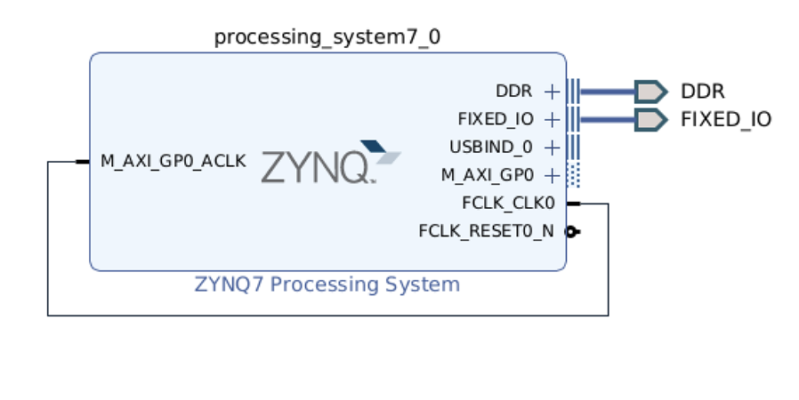
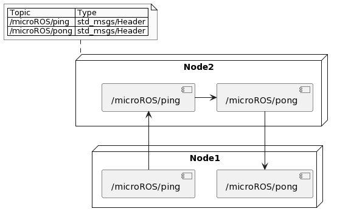
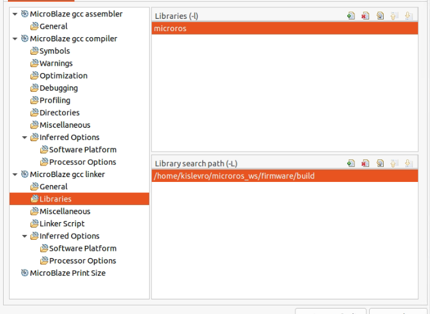
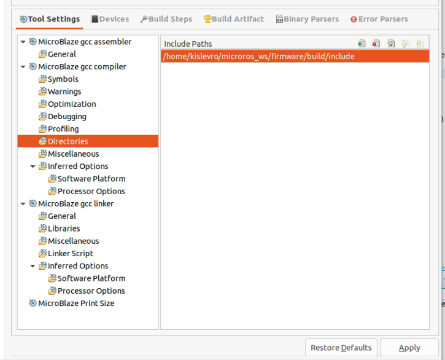
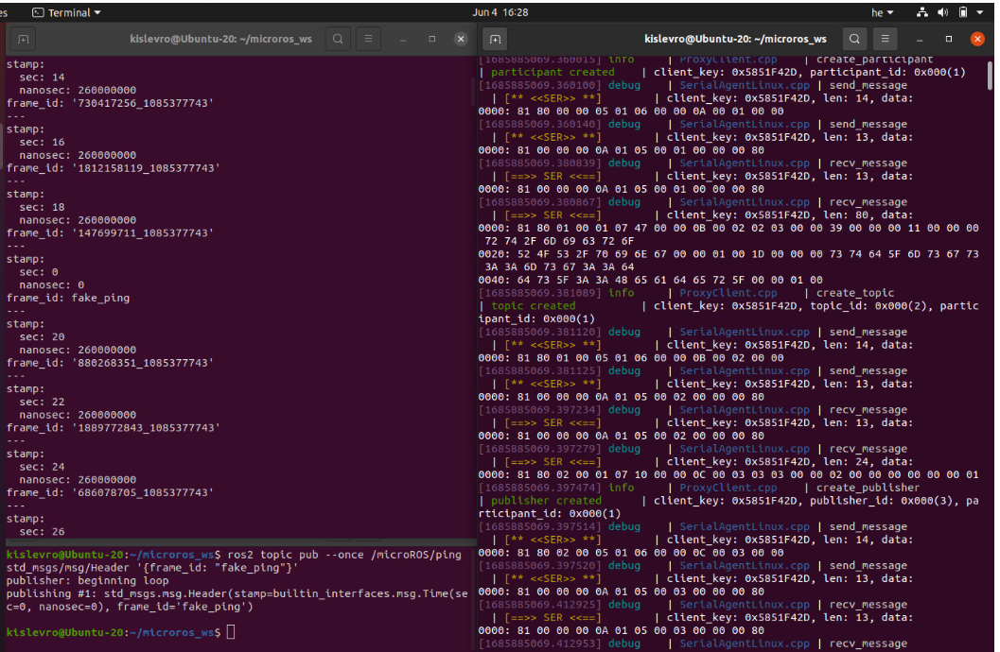

# Micro-ROS Library Generation for Xilinx Devices with UART Custom Transport

## Introduction to micro-ROS

Micro-ROS is a lightweight and real-time communication middleware designed to extend the capabilities of ROS 2 to microcontrollers and FPGA-SoCs, facilitating seamless communication between resource-constrained embedded systems and high-performance computing systems.

## Get Micro-ROS Base from Docker

To begin, obtain the micro-ROS base system using Docker:

```sh
docker run -it --rm --net=host -v ${path_to_Vitis_installation}:${path_to_Vitis_installation} microros/base:foxy
```

Note 1: It's crucial to use the 'foxy' version for a correct build.
Note 2: `path_to_Vitis_installation` is your Xilinx installation folder (e.g. `/tools/Xilinx/Vitis/2023.1`)

Next, set up the micro-ROS workspace:

```sh
# Update dependencies using rosdep
apt update && rosdep update
rosdep install --from-paths src --ignore-src -y

# Build micro-ROS tools and source them
colcon build
source install/local_setup.bash
```

## Build the Micro-ROS Library

Generate the micro-ROS library:

```sh
ros2 run micro_ros_setup create_firmware_ws.sh generate_lib
```

## Modify the provided cmake and colcon files and copy them to the docker container

The cmake files we will use are the `zynq7000_toolchain.cmake` and `zynq7000_colcon.meta` located in the `scripts` folder

1. In the cmake file, make sure to replace the variable `VITIS_PATH` with the installation folder of Vitis from your docker container's perspective (should be the same as `${path_to_Vitis_installation}`).
2. In the same cmake file, make sure to replace the variable `CMAKE_SYSTEM_PROCESSOR` with the name you gave to the processor on the Vivado design (e.g.`processing_system7_0`, see next subsection)
and copy 
3. Copy the necessary files for Zynq and MicroBlaze devices.
   1. First get the `docker_id` of your mounted image. You can get it with the command `docker ps`
   2. From a terminal different than the docker terminal, `cd` to the tutorial folder and copy the meta and cmake files 
```sh
docker cp scripts/zynq7000_toolchain.cmake ${docker_id}:/uros_ws      
docker cp scripts/zynq7000_colcon.meta ${docker_id}:/uros_ws      

```

## Build the micro-ROS library and Copy static library from docker container to host PC:

Go back to your docker container terminal and

```sh
ros2 run micro_ros_setup build_firmware.sh $(pwd)/zynq7000_toolchain.cmake $(pwd)/zynq7000_colcon.meta
```
After waiting for the build, you may encounter some `stderr` messages; you can safely ignore them.

From a terminal different from the terminal of your docker container copy the library with the command
```sh
docker cp -r ${docker_id}:/uros_ws/firmware/build ${your-microroslib-path} 
```

`${your-microroslib-path}` is whatever folder you want to save your library

## Vivado Design for Zynq and Micro-ROS Diagram

Make a Vivado Project, select the board or device you will use (in our case a PYNQ-Z1) and create the a basic Zynq system like the one on the image bellow.



Generate the bitstream and export your XSA file.

## Create a Vitis Platform and FreeRTOS Vitis application and Configure Builder

Implement a ping-pong example using the provided code. The example showcases a micro-ROS node with two publisher-subscriber pairs associated with ping and pong topics.



Follow these steps:

1. Create a Vitis workspace and generate a Platform with your recently generated XSA files and make sure to select the correct processor and OS (Xilinx FreeRTOS).
2. Create a Project with the generated Platform and select and "Empty (c) Project" template.
3. Add all the source files included on the `src` folder.
3. Add custom .a library to the project:
   - **Linker settings**: Project Properties &rarr; C/C++ Build / Settings &rarr; x gcc compiler &rarr; Directories &rarr; Include Paths &rarr; Add path to directory `${your-microroslib-path}/include`
   - **Linker settings**: Project Properties &rarr; C/C++ Build / Settings &rarr; x gcc linker &rarr; Libraries &rarr; Libraries 
   - Add `microros`
   - **Linker settings**: Project Properties &rarr; C/C++ Build / Settings &rarr; x gcc linker &rarr; Libraries &rarr; Library search path 
      - Add path to directory libmicroros `${your-microroslib-path}`




Build everything.

## Create Agent and Test Everything

Compile and flash the board with the ping-pong example.

Follow steps from [micro-ROS documentation](https://micro.ros.org/docs/tutorials/core/first_application_rtos/freertos/) to run the micro-ROS app.

## Running the Micro-ROS Application with Vitis and the agent

## Start the Micro-ROS Agent 

Check if the micro-ROS app is working correctly:

1. Run the micro-ROS agent:

   ```sh
   ros2 run micro_ros_agent micro_ros_agent serial --dev [device] -v 6
   ```

   (Note: Replace `[device]` with the appropriate device name, e.g., `/dev/tty/USB1`)

2. Open a new command line and listen to the ping topic:

   ```sh
   source /opt/ros/$ROS_DISTRO/setup.bash
   ros2 topic echo /microROS/ping
   ```

   Verify that the Ping Pong node is correctly publishing pings.

3. Open another command line and subscribe to the pong topic:

   ```sh
   source /opt/ros/$ROS_DISTRO/setup.bash
   ros2 topic echo /microROS/pong
   ```

   Publish a fake ping and check for the expected pong response.

For now they will not show anything

## Start the Micro-ROS Application from Vitis

Back on Vitis IDE

1. **Navigate to the Debug Perspective:**
   - Ensure Vitis IDE is open and the workspace is configured.
   - Switch to the Debug perspective by selecting **Window > Perspective > Open Perspective > Other... > Debug.**

2. **Connect to the Target Device:**
   - Click the "Debug" button on the toolbar.
   - Select "Debug Configurations..."
   - Ensure your micro-ROS application is selected in the "Project" field.
   - Click "Debug" to start the session.

3. **Observe the Execution:**
   - The application runs on the target device.
   - Observe the execution flow and relevant information in the Debug perspective.

4. **Hit Run**
   - Click the "Run" button on the top toolbar to execute the application.

## Testing the Micro-ROS App

At this point, the micro-ROS app is built, flashed on the FPGA, and the board is connected to a micro-ROS agent. 

You shoud see a similar output to this:



To ensure everything is working, perform the following tests:

1. **Listen to the Ping Topic:**

   ```sh
   source /opt/ros/$ROS_DISTRO/setup.bash
   ros2 topic echo /microROS/ping
   ```

   Check if the Ping Pong node is correctly publishing pings every 5 seconds.

   ```shell
   user@user:~$ ros2 topic echo /microROS/ping
   stamp:
     sec: 20
     nanosec: 867000000
   frame_id: '1344887256_1085377743'
   ---
   ```

2. **Subscribe to the Pong Topic:**

   ```sh
   source /opt/ros/$ROS_DISTRO/setup.bash
   ros2 topic echo /microROS/pong
   ```

   Initially, you don't expect to receive any pong since no ping has been sent yet.

3. **Publish a Fake Ping:**

   ```sh
   source /opt/ros/$ROS_DISTRO/setup.bash
   ros2 topic pub --once /microROS/ping std_msgs/msg/Header '{frame_id: "fake_ping"}'
   ```

   Now, you should see the fake_ping in the ping subscriber console, along with the board’s pings:

   ```shell
   user@user:~$ ros2 topic echo /microROS/ping
   stamp:
     sec: 0
     nanosec: 0
   frame_id: fake_ping
   ---
   ```

4. **Check the Pong Response:**

   Subscribe to the pong topic, and you should see the board's answer to the fake_ping:

   ```sh
   user@user:~$ ros2 topic echo /microROS/pong
   stamp:
     sec: 0
     nanosec: 0
   frame_id: fake_ping
   ---
   ```

These tests ensure that the micro-ROS app is not only publishing pings but also correctly responding to external pings with pongs.
