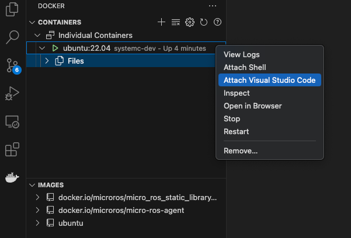
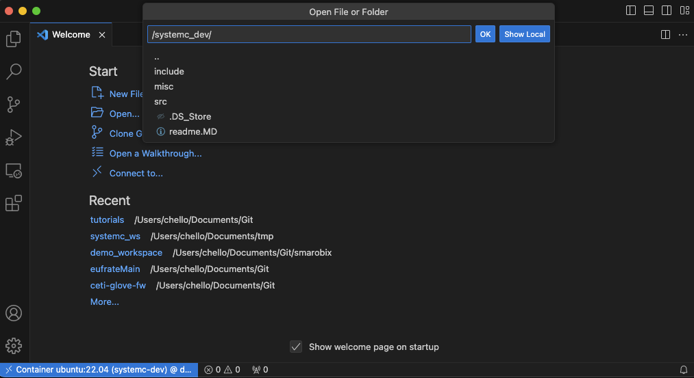

# Using SystemC on a Mac system and Docker (Apple Silicon)

## Setting up a SystemC Development Environment on macOS with Apple Silicon using Docker

This tutorial guides you through setting up a development environment for SystemC on macOS with Apple Silicon using Docker for emulation. 

**Prerequisites:**

* macOS with Apple Silicon (M1, M2, etc.)
* [Docker Desktop for Mac](https://docs.docker.com/desktop/install/mac-install/)

**Software Used:**

* Docker
* [Visual Studio Code](https://code.visualstudio.com/)
* [Docker extension for VScode](https://code.visualstudio.com/docs/containers/overview)
* [Remote - SSH extension for VScode](https://code.visualstudio.com/docs/remote/ssh) 

**Steps:**

1. **Install Docker Desktop:**
   Download and install Docker Desktop for Mac from the official website.

2. **Pull the x86_64 Ubuntu image:**
   Open a terminal window and run the following command:

   ```console
   docker pull ubuntu:22.04 --platform linux/x86_64
   ```

3. **Create a Docker container:**
   Run the following command to create a new container based on the Ubuntu image, naming it `systemc-dev`:

   ```console
   cd <path-to-this-git>
   docker run -it --name systemc-dev --platform linux/amd64 -v $(pwd)/systemc_mac:/systemc_dev ubuntu:22.04
   ```

   This command starts the container in interactive mode (`-it`) and assigns the name `systemc-dev` and mounts the `tutorials/systemc_mac` folder onto `/systemc_dev` in the container.

4. **Install development tools:**
   Inside the container, update the package list and install essential tools:

   ```console
   apt update
   apt upgrade
   apt install build-essential git cmake pkg-config
   ```

5. **Install SystemC:**
   There are two options for installing SystemC:

   * **[Recommended for this tutorial] Using pre-built packages:**

     ```console
     apt install libsystemc libsystemc-dev
     ```

   * **Building from source:**
      Follow steps on [https://github.com/accellera-official/systemc/blob/main/INSTALL.md](https://github.com/accellera-official/systemc/blob/main/INSTALL.md)

      The rest of trhis tutorial will change if you do this

6. **Exit the container (optional):**
   Run the following command to exit the container:

   ```console
   exit
   ```

7. **Run the container in detached mode:**
   Use the following command to start the container in the background:

   ```console
   docker start systemc-dev
   ```

8. **Install the Docker and Remote SSH extension for VS Code:**
   Open VS Code and navigate to the Extensions tab. Search for "Docker" and install the official extension from Microsoft.
   Do the same with for **Remote - SSH**

9. **Connect VS Code to Docker:**
   * Click the Docker icon in the VS Code activity bar.
   * In the Docker pane, right click the container entry and select "Attach Visual Studio Code".

      
   * Ensure the connection is set to your Docker Desktop and open the `systemc_dev` folder.

      

11. **Run the example code `main.cpp`:**
   * Inside your VScode, open a terminal. It should be a terminal inside the docker container located on the `system_dev` folder. The prefix of the terminal should look something like: 
      ```console
      root@482d5b7c1143:/systemc_dev/build# |
      ```
   * use the `CMakeLists.txt` to build the example on this tutorial

      ```console
      mkdir build && cd build
      cmake ..
      cmake --build .
      ```

   * Run the compiled executable:

      ```console
      ./my_systemc_executable
      ```

If everything is set up correctly, you should see:
```console

      SystemC 2.3.3-Accellera --- Mar 17 2022 13:55:26
      Copyright (c) 1996-2018 by all Contributors,
      ALL RIGHTS RESERVED
Hello, SystemC!

Info: /OSCI/SystemC: Simulation stopped by user.
```
printed in the terminal.

**Additional Notes:**

* You can use `g++ -o example example.cpp -lsystemc` on the docker to build any program. But I recommend using CMakeLists.txt to handle better several files which you might need.
* To add more `.cpp` files to your `my_systemc_executable` target, you simply need to modify the `CMakeLists.txt` file to include those additional source files in the `add_executable` command. Here's how you can do it:

   ```cmake
   # Add executable and include additional source files
   add_executable(my_systemc_executable 
      src/main.cpp 
      src/other_file1.cpp 
      src/other_file2.cpp
      # Add more source files as needed
   )
   ```

   Make sure to replace `src/other_file1.cpp`, `src/other_file2.cpp`, etc., with the paths to your additional source files. You can include as many source files as needed to build your executable. 
* All `.hpp` and `.h` inside the include folder are added automatically when building